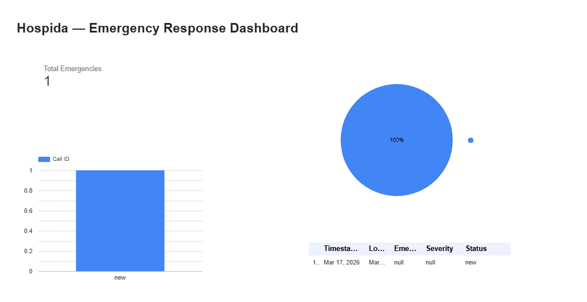

# Hospida — AI Emergency Response Platform

An AI-powered emergency intake and dispatch system for communities
emergency services in Nigeria.

## What it does
- Voice AI agent (Soji) answers emergency calls in English, Yoruba, and Pidgin
- Triages severity automatically (P1–P4)
- Logs every emergency to a live dashboard
- Alerts responders instantly via email/SMS

## Built with
- Vapi — voice AI agent
- Make (Integromat) — automation and data pipeline
- Google Sheets — emergency log
- Next.js + Supabase — responder dashboard (in progress)

- ## Dashboard Preview

[View Live Dashboard →](https://lookerstudio.google.com/reporting/a380ac28-9019-4a24-b74c-9ef44ca2102c)

## Status
🟡 In active development — March 2026

## Daily Build Log
See `/logs` folder for day-by-day progress notes.
